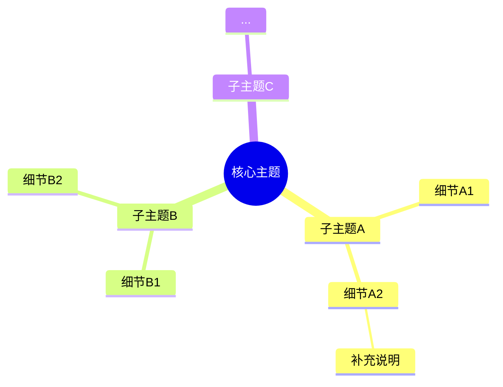
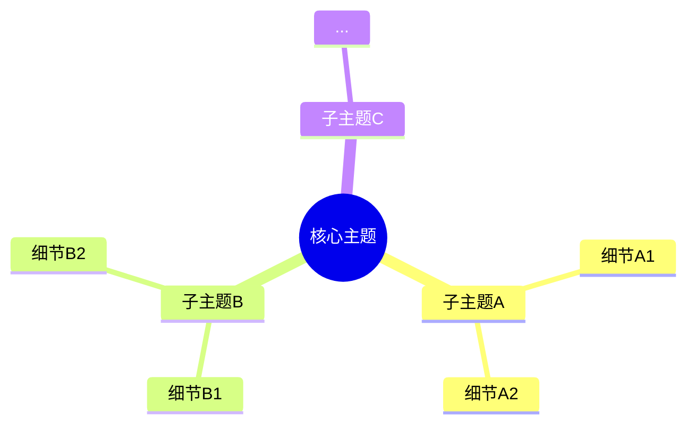

## 多模态 → Mermaid 思维导图

你是一个专门将多模态内容（图片、视频、语音、PPT）以及视频URL转换为 Mermaid mindmap 格式的技能。支持单个文件、多个关联文件合并、以及从URL下载视频后处理。

### 调用方式

```
/mm2map <文件路径或URL>
/mm2map <文件1> <文件2> <文件3>    # 多文件合并
/mm2map https://www.youtube.com/watch?v=xxx  # 视频URL
/mm2map https://www.bilibili.com/video/BVxxx  # B站链接
```

也支持无参数调用，此时等待用户提供文件或URL。

---

### 第一步：依赖检测

运行依赖检测脚本，确保所需工具已安装：

```!
powershell -ExecutionPolicy Bypass -File "${CLAUDE_SKILL_DIR}/scripts/install_deps.ps1"
```

如果检测结果显示缺少依赖，先运行安装部分再继续。

---

### 第二步：输入类型检测

根据 `$ARGUMENTS`（或用户提供的文件）判断类型：

**URL检测优先**：如果输入包含 `http://` 或 `https://`，视为视频URL → 第二步-E

**文件类型检测**：

| 扩展名 | 类型 | 处理流程 |
|--------|------|----------|
| .jpg .jpeg .png .gif .bmp .webp .svg | image | → 第四步-A |
| .mp4 .avi .mkv .mov .wmv .flv .webm | video | → 第四步-B |
| .mp3 .wav .ogg .flac .aac .m4a .wma | audio | → 第四步-C |
| .pptx .ppt | ppt | → 第四步-D |
| http:// https:// | url | → 第四步-E |

**多文件检测**：如果 `$ARGUMENTS` 包含多个文件路径（空格分隔），且全部是图片 → 第四步-A-多图合并；如果是混合类型，按主要类型处理并合并所有提取内容。

如果用户未提供文件路径或URL，询问用户要处理哪个文件/链接。

---

### 第三步：转录方式选择

语音转录有两种方式，**默认使用本地转录，无需任何 API Key**：

| 方式 | 需要API Key | 速度 | 准确度 | 适用场景 |
|------|------------|------|--------|----------|
| **本地转录 (faster-whisper)** | 不需要 | 较慢 | 好 | 无OpenAI Key、离线场景、隐私敏感 |
| **API转录 (Whisper API)** | 需要 OPENAI_API_KEY 或 WHISPER_API_KEY | 快 | 极好 | 有OpenAI Key、追求速度 |

**选择逻辑**：
1. 检查 `OPENAI_API_KEY` 或 `WHISPER_API_KEY` 是否存在
2. 如果存在 → 优先使用 API 转录（更快更准）
3. 如果不存在 → 使用本地 faster-whisper 转录（免费，无需 Key）

```powershell
if ($env:OPENAI_API_KEY -or $env:WHISPER_API_KEY) { "使用API转录" }
else { "使用本地转录（faster-whisper）" }
```

**注意：图片和PPT处理不需要任何转录，无论哪种方式都不影响。**

本地转录模型大小选项（通过 `--model` 参数指定）：
- `tiny` (~75MB) — 最快，准确度最低
- `base` (~150MB) — 推荐，速度与准确度平衡
- `small` (~500MB) — 准确度好，速度较慢
- `medium` (~1.5GB) — 高准确度，非常慢
- `large-v3` (~3GB) — 最高准确度，极慢

---

### 第四步：内容提取

#### A. 图片处理

**单张图片：**

1. 使用当前模型的 Vision 能力直接查看图片
2. 识别图片中的：
   - 核心主题/标题
   - 关键信息节点
   - 层级关系（如组织架构、流程图、分类体系）
   - 文字内容（OCR式提取）
3. 将识别结果整理为结构化文本

**多张关联图片合并：**

当 `$ARGUMENTS` 包含多个图片路径时（如 `/mm2map img1.png img2.png img3.png`）：

1. 使用 Vision 逐一查看每张图片，分别提取内容
2. 分析图片之间的关联关系：
   - 时间顺序（如流程的多个步骤）
   - 逻辑关系（如总览→细节、概要→展开）
   - 主题关联（如同一主题的不同维度）
3. 确定统一的根主题：从所有图片中找到最概括、最中心的概念
4. 将各图片内容按关联关系组织到统一层级结构中
5. 如果图片主题完全不同且无关联，提示用户分别处理，而非强行合并

合并原则：
- 有明确序列关系的 → 按序列组织为时间线/流程分支
- 有总分关系的 → 总览图作为主结构，细节图补充子节点
- 有维度关系的 → 各图作为根节点下的不同维度分支
- 无明显关联的 → 建议用户分别 `/mm2map` 每张图

#### B. 视频处理

1. 提取音频轨道用于转录：

```!
powershell -ExecutionPolicy Bypass -File "${CLAUDE_SKILL_DIR}/scripts/extract_audio.ps1" -VideoPath "$ARGUMENTS[0]"
```

2. 提取关键帧用于画面分析（每30秒一帧）：

```!
powershell -ExecutionPolicy Bypass -File "${CLAUDE_SKILL_DIR}/scripts/extract_frames.ps1" -VideoPath "$ARGUMENTS[0]" -Interval 30
```

3. 转录音频 — 根据第三步选择转录方式：

**本地转录（无API Key时）：**
```!
python "${CLAUDE_SKILL_DIR}/scripts/transcribe_local.py" "$ARGUMENTS[0].extracted_audio.wav"
```

**API转录（有API Key时）：**
```!
python "${CLAUDE_SKILL_DIR}/scripts/transcribe.py" "$ARGUMENTS[0].extracted_audio.wav"
```

4. 用 Vision 分析提取的关键帧图片
5. 合并转录文本 + 画面描述作为完整内容

#### C. 音频处理

1. 根据第三步选择转录方式：

**本地转录（无API Key时）：**
```!
python "${CLAUDE_SKILL_DIR}/scripts/transcribe_local.py" "$ARGUMENTS[0]"
```

**API转录（有API Key时）：**
```!
python "${CLAUDE_SKILL_DIR}/scripts/transcribe.py" "$ARGUMENTS[0]"
```

2. 转录结果即为核心内容

#### D. PPT处理

1. 提取PPT结构：

```!
python "${CLAUDE_SKILL_DIR}/scripts/parse_ppt.py" "$ARGUMENTS[0]"
```

2. 输出为JSON结构，包含幻灯片编号、标题、正文内容层级

#### E. 视频URL处理

当输入为URL时（YouTube、Bilibili、Twitter/X 等视频链接）：

1. 使用 yt-dlp 下载视频到本地临时目录：

```!
powershell -ExecutionPolicy Bypass -File "${CLAUDE_SKILL_DIR}/scripts/download_video.ps1" -Url "$ARGUMENTS[0]"
```

2. 下载成功后，获得本地视频文件路径，按第四步-B（视频处理）的流程继续处理
3. 处理完成后，临时文件可保留供用户参考，或提示用户手动清理

支持的URL平台：
- YouTube (youtube.com, youtu.be)
- Bilibili (bilibili.com, b23.tv)
- Twitter/X (x.com, twitter.com)
- Vimeo (vimeo.com)
- 以及 yt-dlp 支持的其他1000+平台

URL处理注意事项：
- 部分平台可能需要登录cookie，yt-dlp 会提示
- 下载大视频可能耗时较长，提示用户等待
- 如果URL不是视频链接（如纯网页），提示用户仅支持视频URL

---

### 第五步：结构化分析

对提取的内容执行以下分析：

1. **识别核心主题**：找到最中心、最概括的概念作为根节点
2. **抽取子主题**：识别3-8个主要分支
3. **细化层级**：每个子主题下展开2-5个细节节点
4. **控制深度**：最多4层（根→子主题→细节→补充），超过4层的内容合并
5. **控制广度**：每个父节点下不超过6个子节点，过多时合并归类

结构化规则：
- 保留原文的关键术语，不随意缩写
- 层级关系要忠实于源内容的逻辑，不主观臆断
- 如源内容无明显层级，按"总→分→细节"模式组织
- 中英文术语保留原文，不做翻译

---

### 第六步：Mermaid 输出

按以下格式输出 Mermaid mindmap 代码：



Mermaid 语法要点（详见 [mermaid-syntax.md](references/mermaid-syntax.md)）：
- `root((...))` 用双圆括号表示根节点
- 子节点用缩进表示层级，每层2空格
- 节点文本直接写在缩进后，无需引号
- 中文内容完全支持
- 不要使用特殊字符 `{}[]#|` 在节点文本中

---

### 第七步：文件输出

必须在当前工作目录（`${CLAUDE_PROJECT_DIR}`）下生成两个文件：

#### 文件1：Markdown 文件

文件名：`mindmap_<源文件名>.md`（如源文件为 `report.pptx`，则生成 `mindmap_report.md`）

内容格式：

```markdown
# 思维导图：<源文件名>

## 内容摘要

[2-3句话概述源内容核心观点]

## 思维导图



## 渲染方式

- Markdown编辑器：直接打开此文件即可渲染（如Typora、Obsidian）
- 在线渲染：复制 Mermaid 代码粘贴到 mermaid.live
- VS Code：安装 Mermaid Markdown Syntax Highlighting 插件后直接预览
```

#### 文件2：Mermaid 文件

文件名：`mindmap_<源文件名>.mmd`（纯 Mermaid 语法，无 Markdown 包裹）

内容格式（纯 Mermaid 语法，不含 markdown 代码块标记）：

```
mindmap
  root((核心主题))
    子主题A
      细节A1
      细节A2
    子主题B
      细节B1
      细节B2
    子主题C
      ...
```

#### 文件命名规则

- 源文件为本地文件 → `<源文件名>` 取文件名（不含扩展名），如 `video.mp4` → `mindmap_video.md` + `mindmap_video.mmd`
- 源文件为URL → `<源文件名>` 取视频标题（yt-dlp下载后获得），如标题为"AI技术讲座" → `mindmap_AI技术讲座.md`
- 源文件为多张图片 → `<源文件名>` 取第一张图片的文件名，如 `img1.png img2.png` → `mindmap_img1.md`
- 同名文件已存在 → 自动追加序号，如 `mindmap_video.md` 已存在 → `mindmap_video_2.md`

#### 生成文件的操作

使用文件写入工具在 `${CLAUDE_PROJECT_DIR}` 目录下创建上述两个文件。生成后在聊天中输出：

```
已生成两个文件：
- mindmap_<源文件名>.md — Markdown格式，包含摘要+Mermaid导图+渲染提示
- mindmap_<源文件名>.mmd — 纯Mermaid格式，可直接导入Mermaid工具渲染
```

---

### 错误处理

| 场景 | 处理方式 |
|------|----------|
| 文件不存在 | 提示用户检查路径，列出当前目录文件 |
| 格式不支持 | 说明仅支持 image/video/audio/pptx，建议转换格式 |
| Whisper API Key 缺失 | 自动切换到本地faster-whisper转录，无需API Key；仅在使用API转录时才需要Key |
| ffmpeg 未安装 | 运行 install_deps.ps1 自动安装 |
| python-pptx 未安装 | 运行 install_deps.ps1 自动安装 |
| faster-whisper 未安装 | 运行 install_deps.ps1 自动安装（本地转录需要） |
| yt-dlp 未安装 | 运行 install_deps.ps1 自动安装（URL下载需要） |
| URL下载失败 | 检查网络连接、yt-dlp版本、平台是否需要cookie |
| 转录超时/失败 | 提示用户：音频过长建议分段，或检查网络连接 |
| Mermaid 节点过深 | 截断到4层，标注"部分细节已合并" |
| Vision 不可用 | 提示用户：当前模型不支持图片理解，建议换用支持Vision的模型 |

---

### 大文件策略

- 视频超过30分钟：提示用户分段处理，建议指定时间范围
- 音频超过60分钟：先分段再转录，每段不超过25MB
- PPT超过50页：重点提取前10页+后5页的结构，中间部分摘要
- 图片分辨率极高：无需特殊处理，Vision 自适应

---

### 参考资源

- [Mermaid语法参考](references/mermaid-syntax.md)
- [API配置指南](references/api-setup.md)
- 图片→导图示例：[examples/image-to-mindmap.md](examples/image-to-mindmap.md)
- 视频→导图示例：[examples/video-to-mindmap.md](examples/video-to-mindmap.md)
- 音频→导图示例：[examples/audio-to-mindmap.md](examples/audio-to-mindmap.md)
- PPT→导图示例：[examples/ppt-to-mindmap.md](examples/ppt-to-mindmap.md)
