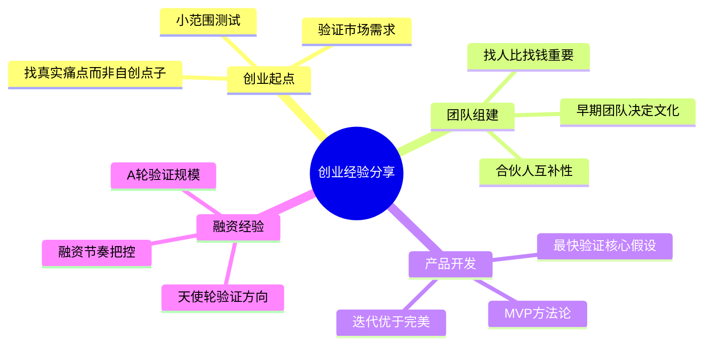

## 音频 → Mermaid 思维导图 示例

### 输入

一段20分钟的播客音频 `startup_podcast.mp3`，两位创业者讨论创业经验，主要话题：
- 创业起点：如何找到好点子（3分钟）
- 团队组建：找人比找钱重要（5分钟）
- 产品开发：MVP方法论（5分钟）
- 融资经验：天使轮到A轮（7分钟）

### 处理流程

1. `transcribe.py` → Whisper API 转录为文本
2. AI 分析转录文本 → 识别核心主题和层级关系
3. 结构化分析 → Mermaid 输出

### 转录输出（摘要）

```
"主持人：今天我们请到两位创业者分享经验...
嘉宾A：创业起点最重要是找到真实痛点，不是自己想的点子...
嘉宾B：找人比找钱重要，早期团队决定公司文化...
嘉宾A：MVP方法论就是最快验证核心假设...
嘉宾B：融资节奏很重要，天使轮验证方向，A轮验证规模..."
```

### 最终输出

## 内容摘要

这是一期创业经验分享播客，两位嘉宾围绕创业起点、团队组建、MVP产品开发和融资节奏四个核心话题展开讨论，强调真实痛点验证和团队文化建设的重要性。

## 思维导图



## 渲染方式

- Markdown编辑器：直接粘贴即可渲染（如Typora、Obsidian）
- 在线渲染：粘贴到 mermaid.live
- VS Code：安装 Mermaid Markdown Syntax Highlighting 插件
