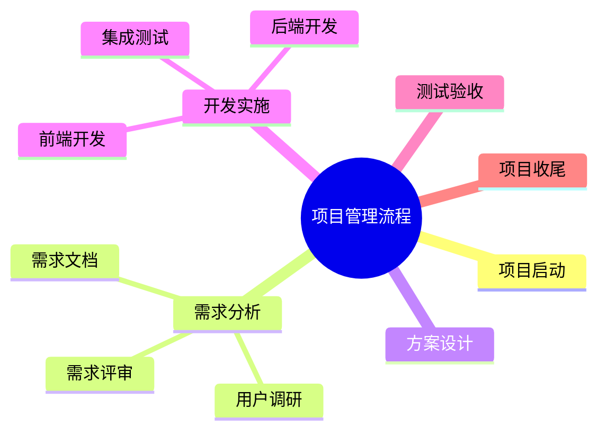

## 图片 → Mermaid 思维导图 示例

### 输入

一张包含"项目管理流程"的组织架构图，内容包括：
- 项目启动 → 需求分析 → 方案设计 → 开发实施 → 测试验收 → 项目收尾
- 需求分析下有：用户调研、需求文档、需求评审
- 开发实施下有：前端开发、后端开发、集成测试

### 处理流程

1. AI Vision 直接查看图片
2. 识别核心主题："项目管理流程"
3. 提取层级关系和文字内容
4. 结构化分析 → Mermaid 输出

### 输出

## 内容摘要

这是一张项目管理流程的组织架构图，展示了从项目启动到收尾的完整流程，包含需求分析、方案设计、开发实施、测试验收等关键阶段及其子任务。

## 思维导图

## 渲染方式

- Markdown编辑器：直接粘贴即可渲染（如Typora、Obsidian）
- 在线渲染：粘贴到 mermaid.live
- VS Code：安装 Mermaid Markdown Syntax Highlighting 插件
