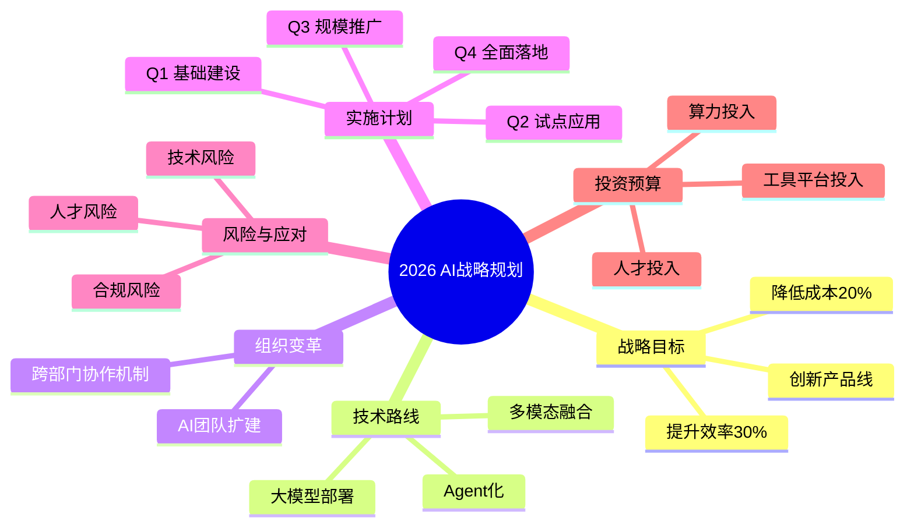

## PPT → Mermaid 思维导图 示例

### 输入

一个12页的PPT文件 `ai_strategy.pptx`，内容为公司AI战略规划：
- 第1页：标题 "2026 AI战略规划"
- 第2页：战略目标（提升效率30%、降低成本20%、创新产品线）
- 第3-4页：技术路线（大模型部署、Agent化、多模态融合）
- 第5-6页：组织变革（AI团队扩建、跨部门协作机制）
- 第7-8页：实施计划（Q1-Q4里程碑）
- 第9页：风险与应对
- 第10-11页：投资预算
- 第12页：总结与下一步

### 处理流程

1. `parse_ppt.py` → 提取PPT结构为JSON
2. AI 分析JSON → 识别核心主题和幻灯片层级关系
3. 结构化分析 → Mermaid 输出

### parse_ppt.py 输出（摘要）

```json
{
  "total_slides": 12,
  "slides": [
    { "slide_number": 1, "title": "2026 AI战略规划", "content": [{"text": "2026 AI战略规划", "level": 0}] },
    { "slide_number": 2, "title": "战略目标", "content": [{"text": "提升效率30%", "level": 1}, {"text": "降低成本20%", "level": 1}, {"text": "创新产品线", "level": 1}] },
    { "slide_number": 3, "title": "技术路线", "content": [{"text": "大模型部署", "level": 1}, {"text": "Agent化", "level": 1}, {"text": "多模态融合", "level": 1}] }
  ]
}
```

### 最终输出

## 内容摘要

这份PPT为公司2026年AI战略规划，涵盖战略目标、技术路线、组织变革、实施计划、风险应对和投资预算六大板块，目标为效率提升30%和成本降低20%。

## 思维导图



## 渲染方式

- Markdown编辑器：直接粘贴即可渲染（如Typora、Obsidian）
- 在线渲染：粘贴到 mermaid.live
- VS Code：安装 Mermaid Markdown Syntax Highlighting 插件
