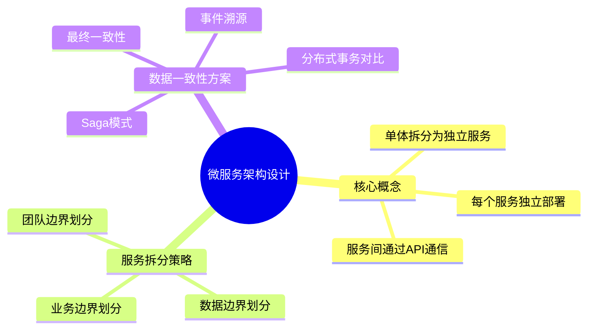

## 视频 → Mermaid 思维导图 示例

### 输入

一个15分钟的技术讲座视频 `tech_talk.mp4`，主题为"微服务架构设计"，演讲者讲解了：
- 微服务核心概念（5分钟）
- 服务拆分策略（5分钟）
- 数据一致性方案（5分钟）
- 关键画面：架构图、服务拆分示意图、数据一致性对比表

### 处理流程

1. `extract_audio.ps1` → 提取音频轨道为 WAV
2. `transcribe.py` → Whisper API 转录音频为文本
3. `extract_frames.ps1` → 每30秒提取关键帧（约15帧）
4. AI Vision → 分析关键帧图片内容
5. 合并转录文本 + 画面描述 → 结构化分析 → Mermaid 输出

### 转录输出（摘要）

```
"大家好，今天我们聊聊微服务架构设计。首先，微服务的核心概念是将单体应用拆分为独立的小服务...
服务拆分策略需要考虑业务边界、数据边界和团队边界...
最后，数据一致性是微服务最大的挑战，我们需要考虑Saga模式、事件溯源等方案..."
```

### 最终输出

## 内容摘要

这是一场关于微服务架构设计的技术讲座，涵盖微服务核心概念、服务拆分策略和数据一致性方案三大主题，重点讲解了业务边界划分和Saga一致性模式。

## 思维导图



## 渲染方式

- Markdown编辑器：直接粘贴即可渲染（如Typora、Obsidian）
- 在线渲染：粘贴到 mermaid.live
- VS Code：安装 Mermaid Markdown Syntax Highlighting 插件
