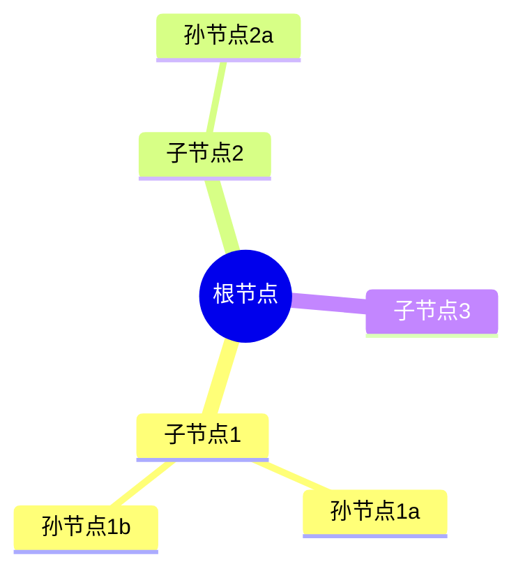
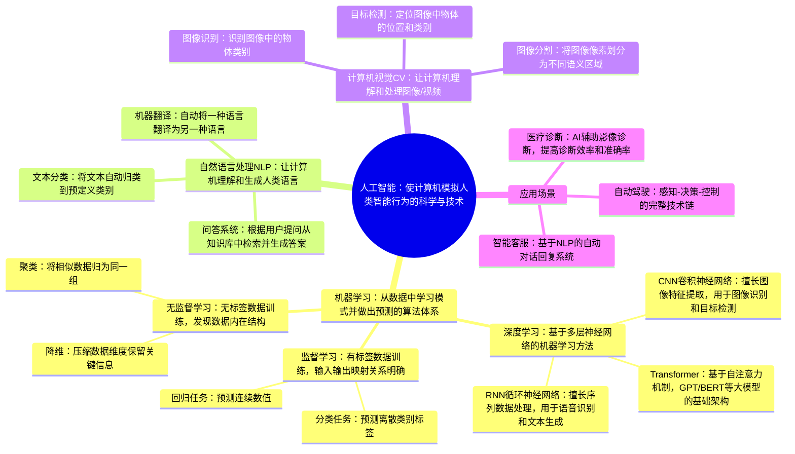

## Mermaid Mindmap 语法参考

### 基本结构



### 语法规则

1. **声明类型**: 必须以 `mindmap` 开头
2. **根节点**: 用 `root((...))` 双圆括号包裹，表示圆形根节点
3. **层级缩进**: 用空格缩进表示父子关系，每层缩进2个空格
4. **节点文本**: 直接写在缩进后，无需引号或括号
5. **节点形状**:
   - `((文本))` — 圆形（仅用于根节点）
   - `(文本)` — 圆角矩形
   - `[文本]` — 矩形
   - 默认无括号 — 矩形

### 示例：中文思维导图（详尽版）

**重要：节点文本应包含完整定义和关键信息，而非简短关键词。**



### 禁止事项

- 节点文本中不要使用 `{ } [ ] # |` 这些特殊字符（Mermaid 会误解析）
- 不要在节点文本中使用换行符
- 不要在同一节点中使用括号嵌套，如 `((外((内)))` 不合法
- **深度无上限**：完整保留源内容的层级结构，不做截断
- **广度无上限**：每个父节点下的子节点数量不限，忠实呈现所有知识点

### 特殊字符处理

如果节点文本必须包含特殊字符，用以下替换：

| 原字符 | 替换 |
|--------|------|
| `{` `}` | 用中文 `{` `}` 或删除 |
| `[` `]` | 用中文括号或删除 |
| `#` | 用 `No.` 或中文 `第` |
| `|` | 用 `-` 或 `或` |

### 渲染方式

1. **mermaid.live** — 在线渲染器: https://mermaid.live
2. **Typora** — Markdown编辑器，直接粘贴渲染
3. **Obsidian** — 安装 Mermaid 插件后渲染
4. **VS Code** — 安装 "Mermaid Markdown Syntax Highlighting" 扩展
5. **HTML** — 使用 mermaid.js CDN:
   ```html
   <script src="https://cdn.jsdelivr.net/npm/mermaid/dist/mermaid.min.js"></script>
   <div class="mermaid">
   mindmap
     root((主题))
       ...
   </div>
   ```
